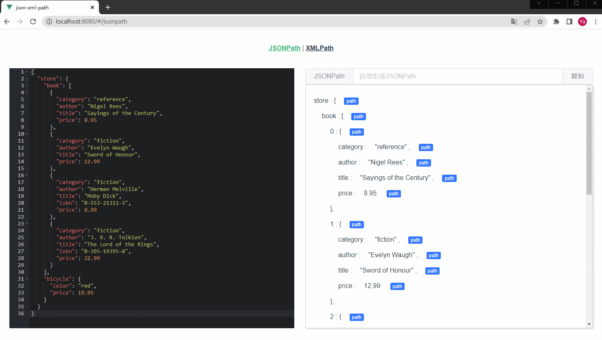
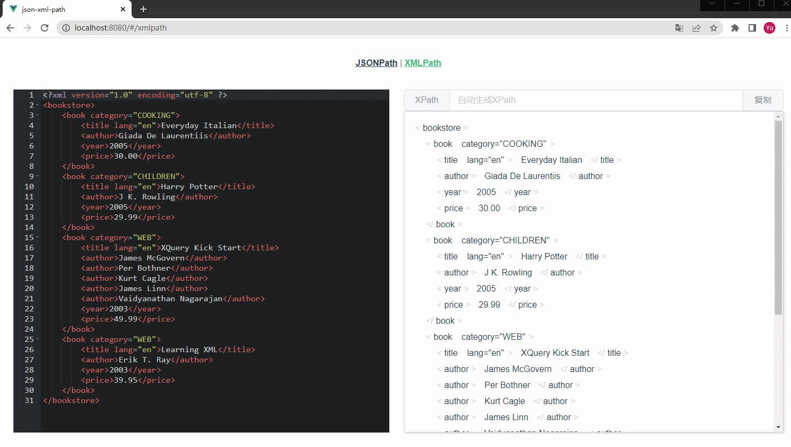
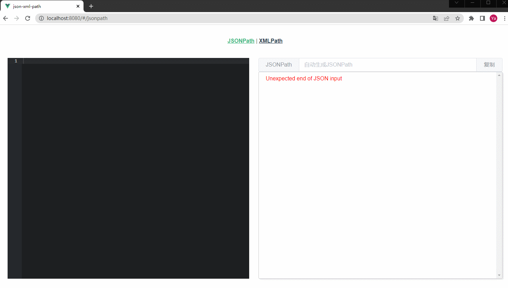

### 说明
本项目是基于Vue2实现的JSONPath和XPath解析工具。

### 使用

下载项目
```shell
git clone https://gitee.com/web1024cn/vue-jsonpath-and-xpath.git
```

初始化依赖
```shell
npm install
```

安装依赖过程中容易出现 `node-sass` 安装失败的问题，如果安装依赖时报错，可以先在本地全局安装 `npm i -g node-gyp`。

启动项目
```shell
npm run dev
```

浏览器中访问 `http://localhost:8080/#/` 打开项目

### 演示

**JSONPath和XPath解析**



**一键复制Path规则**



**代码校验**

