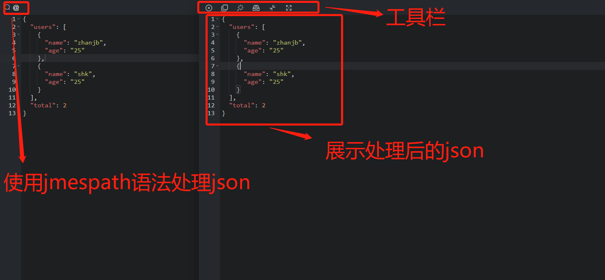

### 说明
本项目是一个json解析工具。

### 二次开发

获取项目
```shell
git clone https://github.com/zjbshk/json-format.git
```

初始化依赖
```shell
npm install
```

安装依赖过程中容易出现 `node-sass` 安装失败的问题，如果安装依赖时报错，可以先在本地全局安装 `npm i -g node-gyp`。
或
```
npm uninstall node-saas
npm install saas
```


启动项目
```shell
npm run dev
```

浏览器中访问 `http://localhost:8080/#/` 打开项目

### 工具演示


